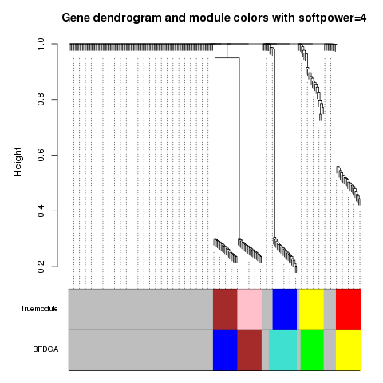
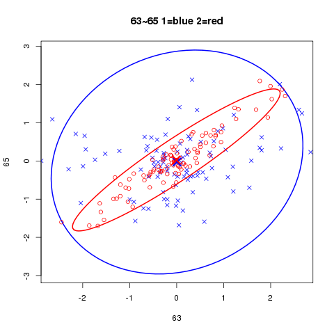
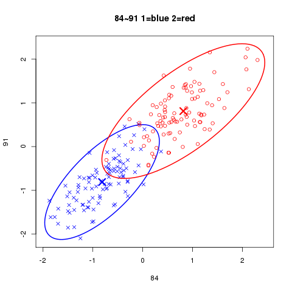
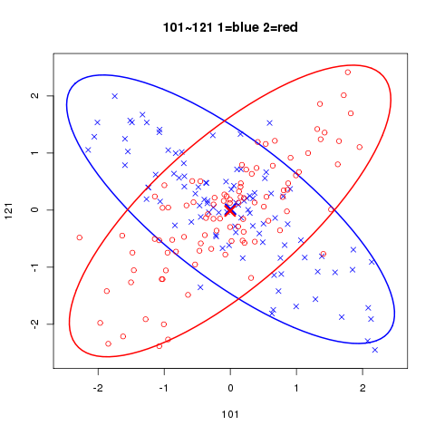
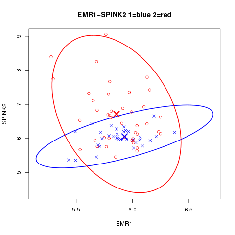
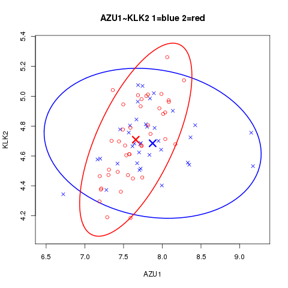

This is a vegnette for R package BFDCA. BFDCA is a comprehensive tool of using Bayes factor for Differential Co-expression (DC) analysis. BFDCA contains three main functions: (1) clustering condition-specific genes into functional DC subunits; (2) quantitatively characterizing the regulatory impact of genes based on their differential connectivity within DC structures; and (3) providing a DC based prediction model to predict case/control phenotypes by taking DC significant gene pairs as markers. 

### System prerequisite:
 
 * R version 3.0.0 or higher. 
 
 * Linux systems. It has been tested on several linux systems, including CentOS release 6.7, Red Hat Enterprise Linux Server release 5.11, Fedora21. 
 
 * The GNU Scientific Library (GSL). It's included in most GNU/Linux distributions. But if your system doesn't contain it, please refer to "https://www.gnu.org/software/gsl/" for installation. As an example, in Fedora system, you can easily install GSL by: 
```{r eval=FALSE}
yum install gsl_devel
```
### Installation of BFDCA:
Before install the BFDCA package, the following packages are required to be installed: fastcluster, WGCNA and its depends, igraph, and dynamicTreeCut (>=1.62). For some linux systems you may need to install Rcpp. To install the required packages, in R environment, simply type: 
```{r eval=FALSE}
source("http://bioconductor.org/biocLite.R") 
biocLite(c("AnnotationDbi", "impute", "GO.db", "preprocessCore")) 
install.packages("flashClust")
install.packages("WGCNA")
install.packages("igraph")
install.packages("dynamicTreeCut")
install.packages("Rcpp")
```
Then install package BFDCA by typing the followings in R environment:
```{r eval=FALSE}
install.packages("${your_directory}/BFDCA_1.0.tar.gz")  # ${your_directory} is the directory you save BFDCA_1.0.tar.gz.
```

### Analyses of simulation data (step-by-step):
* Step1, load simulation data.
```{r eval=FALSE}
library(BFDCA) # load the BFDCA package.

data(SimulationSmall)
#load the simulation data "SimulationSmall" which is a matrix containing class information and expression data. The first column corresponds to class labels, other columns correspond to gene expressions, and the rows correspond to samples. Details of the data are in the manual of BFDCA.
class<-SimulationSmall[,1];
#extract class from SimulationSmall.
gene<-SimulationSmall[,2:dim(SimulationSmall)[2]];
#extract expression data from SimulationSmall.
```
* Step2, estimate the strength of pair-wise differential co-expression by Bayes factor from an expression matrix with labels of classes.

```{r eval=FALSE}
bfmatrix<-Compute_bf(gene,class,classlabel=c("1","2"),bfthr=NULL,echo=TRUE);
#bfmatrix is a data frame containing the information of pair-wise Bayes factors. It can be used as an input for other functions, like BF_WGCNA. 
#argument bfthr is set as NULL, so all the gene pairs will be kept for the following steps. 
#details are in the manual of BFDCA.
save(bfmatrix,file="bfmatrix.Rdata");
#save pair-wise Bayes factors into "bfmatrix.Rdata". 
```
* Step3, identify differential co-expression modules through pair-wise Bayes factors.
```{r eval=FALSE}
in_groupgenes=20;
truemodule<-rep(c(rep("grey",2*in_groupgenes),rep("yellow",in_groupgenes),rep("blue",in_groupgenes),rep("red",in_groupgenes),rep("pink",in_groupgenes),rep("brown",in_groupgenes),rep("grey",100)));
#truemodule is a vector represents the colors assigned to the real DC modules in the simulation data.   
obt<-BF_WGCNA(gene,bfmatrix,bfthr=0,keepedges=0,plotTree=TRUE,plotfile="Gene_dendrogram_and_module_colors.pdf",trueModule=truemodule,minClusterSize=5,softPower=4,deepSplit=2);
#in this step, WGCNA package is applied on the Bayes factor matrix (bfmatrix) to infer DC modules. After running this function, a BFobt object will be generated and stored in obt. A plot (Figure 1) of a hierarchical clustering dendrogram and color annotations of modules will be in file "Gene_denfrogram_and_module_colors.pdf".
```


Figure 1: Gene dendrogram with color annotations of real DC modules from file "Gene_denfrogram_and_module_colors.pdf". Note that the color assigned by BFDCA is not exactly as the same as the color assigned to the real DC modules, the color is only used to distinguish different module assignments.

* Step4, output the resulting differential co-expression modules and some information of gene-gene interactions.
```{r eval=FALSE}
bfoutput<-BF_output_networks(gene,class,classlabel=c("1","2"),obt,mst2file="MST2.txt",bfthr=6,corthres=0.3); 
#the function returns a list containing:
#(1) information for DC gene nodes, including module assignment and weight assignment.
#(2) information for DC gene pairs, including a full network built based on DC modules. 
#the essential links among genes represented by a union of First and Second Minimal Spanning Tree (MST2) will be outputed into file "MST2.txt" specified by argument mst2file.
#Other arguments and details can be found in manual of BFDCA.

write.table(bfoutput$genegroups,file="gene_groups.txt",append=FALSE,row.names=FALSE,col.names=TRUE,quote=FALSE,sep="\t");
#output the DC gene nodes with information of DC modules into "gene_groups.txt".
write.table(bfoutput$network,file="gene_network.txt",append=FALSE,row.names=FALSE,col.names=TRUE,quote=FALSE,sep="\t");
#output the DC gene pairs into "gene_network.txt".
```
* Step5, select significant DC gene pairs.
```{r eval=FALSE}
sigdc<-sigDCpair_st1(obt,mst2="MST2.txt",bfthr=6,weight_cutoff=0.8);
#in this function, we set Bayes factor threshold bfthr as 6 and the threshold of end-node weights as 0.8, each edge in "MST2.txt" will be searched, and those that meet both of the two criterions will be remained. The result is a data frame which contains three columns, the first represents the ids for gene1, the second represents the ids for gene2 and the last represents the scores for each gene pair in a descending order. Edges in sigdc served as the candidate significant DC gene pairs.
sigDCpair_SFS(gene,class,c("1","2"),sigDC=sigdc,DC_acc="DC_pair_acc.txt",by=20,LOOCV=TRUE);
# in this function, a generalized sequential forward selection (SFS) algorithm is used on the candidate significant DC gene pairs "sigdc". Start with an initial subset of gene pairs with size N=1, the next by=20 gene pairs are repeatedly added to the subset of gene pairs (N=N+by). The goodness of top N subset of gene pairs are characterized by the leave-one-out cross-validation (LOOCV) to monitor the accuracy for the top N gene pairs, and the accuracy is calculated by DC-based prediction model. The results are stored in file "DC_pair_acc.txt". It consists of two columns, the first indicates the number of top gene pairs and the second indicates the LOOCV accuracy.
top_edges<-sigdc[1:21,];
#according to "DC_pair_acc.txt", the top 21 gene pairs is a tradeoff between maximizing the accuracy and minimizing the edge number. 
write.table(top_edges,file="selected_DC_pair.txt",append=FALSE,row.names=FALSE,col.names=FALSE,quote=FALSE,sep="\t");
# output the results into file "selected_DC_pair.txt".
```
> An example of function **BFtrain** and **BFtest**

Function BFtrain trains a DC-based prediction model on traing data by using the pre-selected DC gene pairs as features. Function BFtest predicts the class labels for testing data. Here, we randomly sample 100 samples from SimulationSmall data as the training data, and the remaining samples are used as the testing data. According to step5, the 21 gene pairs in "selected_DC_pair.txt" are used as features.
```{r eval=FALSE}

library(BFDCA)
# load the BFDCA package.
data(SimulationSmall)
# load the simulation data SimulationSmall.
class<-SimulationSmall[,1];
# extract class labels from SimulationSmall.
gene<-SimulationSmall[,2:dim(SimulationSmall)[2]];
# extract expression data from SimulationSmall.

train_index<-sample(dim(gene)[1],100,replace=FALSE);
# randomly sample 100 samples form simulation data.

train<-gene[train_index,];
train_class<-class[train_index];
# generate training data. 

test<-gene[-train_index,];
test_class<-class[-train_index];
# generate testing data. 

edges<-read.table("selected_DC_pair.txt",header=FALSE, sep="\t");
# use the selected 21 gene pairs as features.

model<-BFtrain(train,train_class,c("1","2"),edges,bfthr=6);
# train a DC-based prediction model.
tclass<-BFtest(test,model);
# predict the class labels for testing data.
accuracy<-sum(tclass==test_class)/length(test_class);
print(accuracy);
# calculate the accuracy.
```

> Examples of plotting DC gene pairs.

Function BFplot is used to plot gene expression patterns of DC gene pairs. It will generate a dot plot for the DC gene pairs with x-axis and y-axis represent gene expression levels for each gene in the DC gene pair. Dots in different colors and shapes represent samples from different classes and circles represent the contours of the estimated bivariate normal density.  
```{r eval=FALSE}

library(BFDCA)
# load the BFDCA package.
data(SimulationSmall)
# load the simulation data SimulationSmall.
class<-SimulationSmall[,1];
# extract class labels from SimulationSmall.
gene<-SimulationSmall[,2:dim(SimulationSmall)[2]];
# extract expression data from SimulationSmall.
BFplot(gene,class,c("1","2"),63,65);
```

```{r eval=FALSE}
BFplot(gene,class,c("1","2"),84,91);
```

```{r eval=FALSE}
BFplot(gene,class,c("1","2"),101,121);
```


```{r eval=FALSE}
# the user can also plot multiple DC gene pairs into a file in pdf format by function BFplot2files.
BFplot2files(gene,class,c("1","2"),"selected_DC_pair.txt",plotfilename="Plotedges.pdf")
# it will plot a figure for all the gene pairs in file "selected_DC_pair.txt" and merge these figures into file "Plotedges.pdf".
```

### Analyses on acute lymphoblastic leukemia (ALL) dataset
The following steps show how to apply BFDCA on experimental expression data. For the dataset with 8638 genes, it requirs at least 3 GB of memory. Some of the following steps may take several hours to complete vary with CPU power, it's better to run it on clusters.
```{r eval=FALSE}
library(BFDCA);# load the BFDCA package.
data(ALL);# load the ALL data, which is a list containing class information and expression after preprocessing. ALL$class is a vector containing class information, with "1" indicates BCR/ABL mutation and "2" indicates no cytogenetic abnormalities. ALL$data is a data frame containing expression data. Details are in the manual of BFDCA.
bfmatrix<-Compute_bf(ALL$data,ALL$class,classlabel=c("1","2"),bfthr=6,echo=FALSE); # Compute_bf is the most time-consuming one among all the steps, it may take several hours to complete.
save(bfmatrix,file="bfmatrix.Rdata");

obt<-BF_WGCNA(ALL$data,bfmatrix,plotfile="Gene_dendrogram_and_module_colors_ALL.pdf",minClusterSize=20,deepSplit=2);
# in this application, we used hard thresholding. The argument softPower is set as 1, and argument keepedges is used as the default value which is equal to the number of genes involved in ALL$data.

bfoutput<-BF_output_networks(ALL$data,ALL$class,classlabel=c("1","2"),obt,mst2file="MST2_ALL.txt",bfthr=6,corthres=0.2); 
write.table(bfoutput$genegroups,file="gene_groups_ALL.txt",append=FALSE,row.names=FALSE,col.names=TRUE,quote=FALSE,sep="\t");
# output the DC gene nodes with information of DC modules into "gene_groups_ALL.txt".
write.table(bfoutput$network,file="gene_network_ALL.txt",append=FALSE,row.names=FALSE,col.names=TRUE,quote=FALSE,sep="\t");
# output the DC gene pairs into "gene_network_ALL.txt".

sigdc<-sigDCpair_st1(obt,mst2="MST2_ALL.txt",bfthr=6,weight_cutoff=0.8); # first step of selecting significant DC gene pairs.
save(sigdc,file="sigdc_ALL.Rdata");# save results to "sigdc_ALL.Rdata".
sigDCpair_SFS(ALL$data,ALL$class,c("1","2"),sigDC=sigdc,DC_acc="DC_pair_acc_ALL.txt",by=10,LOOCV=TRUE);# second step of selecting significant DC gene pairs.
top_edges<-sigdc[1:211,];
# according to "DC_pair_acc_ALL.txt", the top 211 gene pairs is a tradeoff between maximizing the accuracy and minimizing the edge number. 
write.table(top_edges,file="selected_DC_pair_ALL.txt",append=FALSE,row.names=FALSE,col.names=FALSE,quote=FALSE,sep="\t");# output the results into file "selected_DC_pair_ALL.txt".
```
> Test the prediction power of selected gene pairs for ALL dataset

The 211 gene pairs in "selected_DC_pair_ALL.txt" are used as features. 60 samples from ALL dataset are randomly sampled as the training data, and the remaining samples are used as the testing data. 
```{r eval=FALSE}
library(BFDCA);# load the BFDCA package.
data(ALL);# load the ALL data.

train_index<-sample(dim(ALL$data)[1],60,replace=FALSE);
# randomly sample 60 samples form ALL$data.
train=ALL$data[train_index,];
train_class=ALL$class[train_index];
# generate training data.

test=ALL$data[-train_index,];
test_class=ALL$class[-train_index];
# generate testing data.

edges<-read.table("selected_DC_pair_ALL.txt",header=FALSE, sep="\t");
# use the selected 211 gene pairs as features.

model<-BFtrain(train,train_class,c("1","2"),edges,bfthr=6);
# train a DC-based prediction model
tclass<-BFtest(test,model);
# predict the class labels for testing data
accuracy<-sum(tclass==test_class)/length(test_class);
print(accuracy);
# calculate the accuracy
```
> Ploting examples of DC gene pairs for ALL dataset

We show how to use function BFplot to plot gene expression patterns of DC gene pairs. It will generate a dot plot for the DC gene pairs with x-axis and y-axis represent gene expression levels for each gene in the DC gene pair. Dots in different colors and shapes represent samples from different classes and circles represent the contours of the estimated bivariate normal density.  

```{r eval=FALSE}
library(BFDCA);# load the BFDCA package.
data(ALL);# load the ALL data.
BFplot(ALL$data,ALL$class,c("1","2"),"EMR1","SPINK2");
```

```{r eval=FALSE}
BFplot(ALL$data,ALL$class,c("1","2"),"AZU1","KLK2");
```


```{r eval=FALSE}
BFplot2files(ALL$data,ALL$class,c("1","2"),"selected_DC_pair_ALL.txt",plotfilename="Plotedges_ALL.pdf")
# for all the gene pairs in "selected_DC_pair_ALL.txt", it will plot a figure to show the gene expression patterns of the gene pair, and all these figures will be merged into file "Plotedges_ALL.pdf".
```
